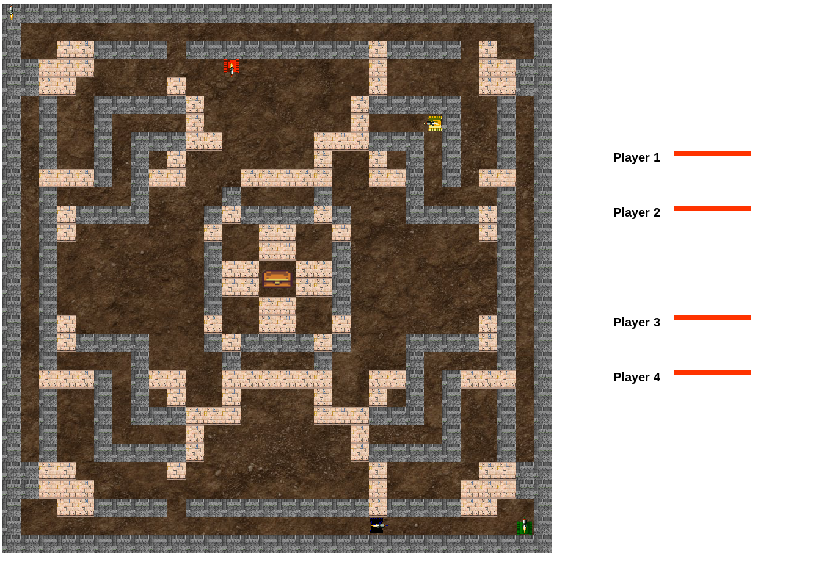

# Battletanks

  
 
## About
This is a 4-player battletanks game.  
This project is a partial fullfillment for CS2433 (Principles of Programming Languages II) offered by Dr. Saurabh Joshi at IIT Hyderabad in Spring'18 semester.  
The project was done mainly to understand the concurrency patterns in Go. We have made extensive use of concurrent features of Go in both communication (between game server and the client) and gameplay. The project also utilises the Websockets protocol to enable low-latency bi-directional communication.

## Gameplay

 

## Contributors
Ninad Akolekar  
Abhishek Pawar  
Sahil Sirowa 
